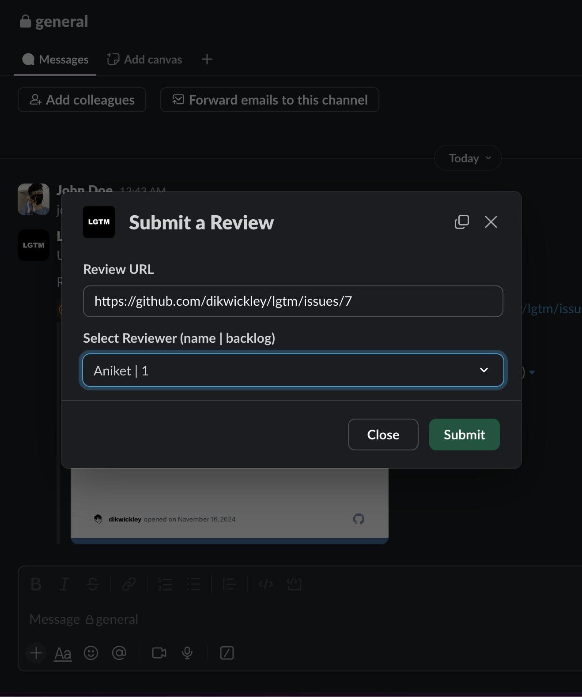
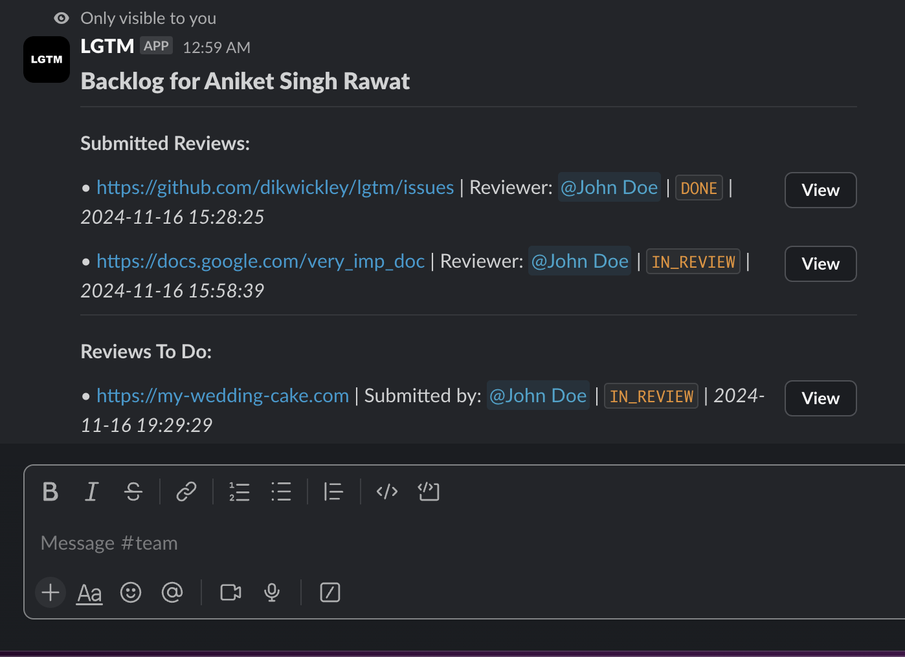
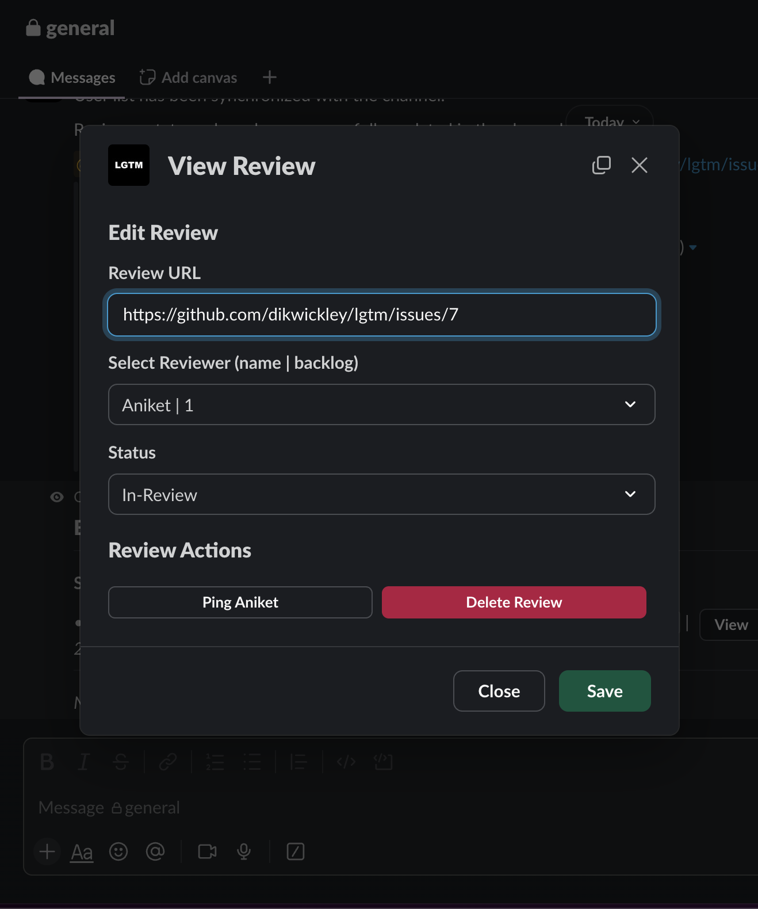
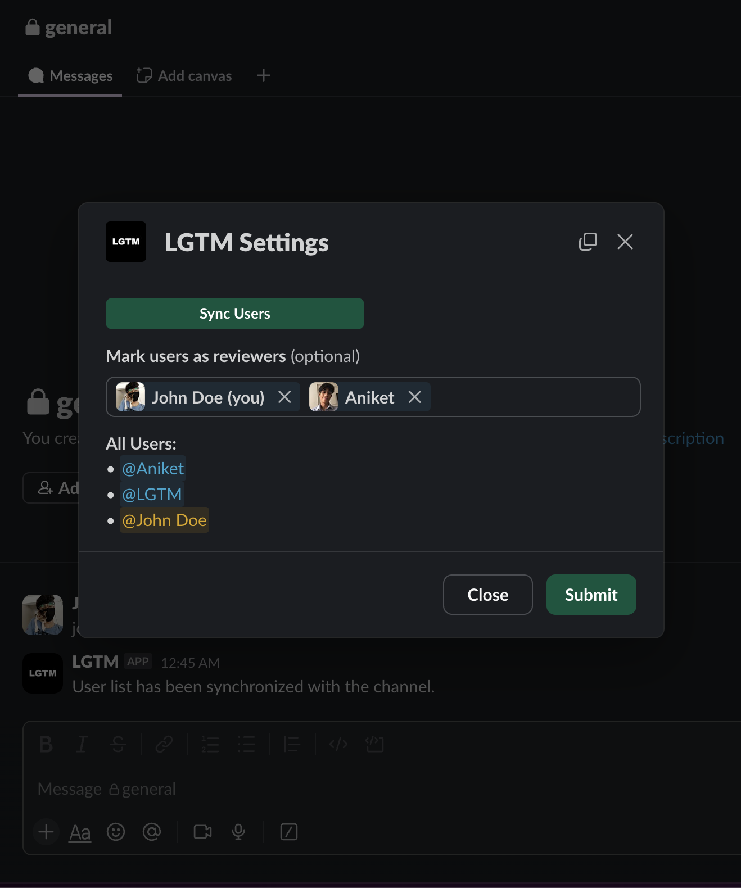

Manage your peer reviews right from slack!

LGTM is a slack app that makes it easy for members of a slack channel to collobrate by making the review process simpler and trackable.


## commands

LGTM currently supports 3 simple commands.

### `/review`

Review commands lets you create new items to review.

You can put any URL that you would like to get reviewed; it can be a google docs link, github pull request, jira document, your amazon shoppping cart, etc etc.

Then you can select one reviewer from list of avaialable reviwers. PS The one with the least amount of things to review is choosen by default (slackers are not spared).




### `/backlog`

You can see all the reviews you have submitted and recieved by using this command. It sends a message with detailed information, but don't worry this message is only visible to you!



Beside each review, there is a view button. Pressing that button opens up a modal where you can edit that review item, like updating the URL or assigning it to someone else (they will get pinged if you do that!).

You can also manually "ping" the reviewer if they are delaying (slackers!).
You can also delete the review by pressing that red button.



`/config` : Settings

You can select who can be deemed a reviewer from the settings page.

PS currently LGTM needs a manual sync to keep track of who is in the channel or not, so please "sync users" whenever someone joins or leaves the group! (I know it's a hassale, this will be automated in future.)



## to run

```
// Set up all .env vars

python app.py
```

And that's it. 